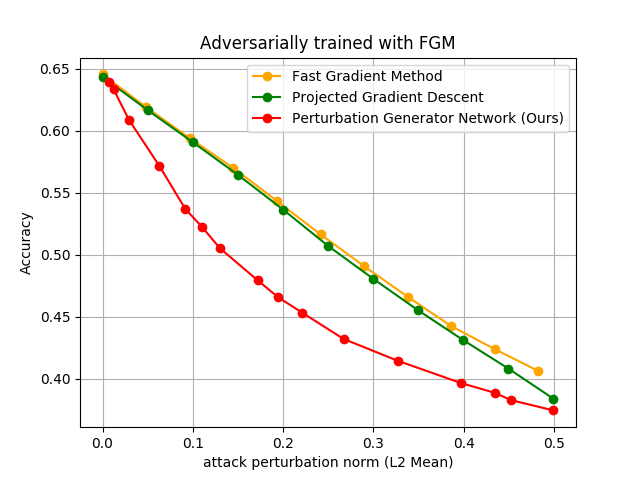

# Advesarial-training-with-perturbation-generator-networks
Tensorflow implementation of [Adversarial training with perturbation generator networks]

## Prerequisties
- Python 3.3+
- [Tensorflow 1.14.0](https://github.com/tensorflow/tensorflow/tree/v1.14.0)
- [Cleverhans 3.0.1](https://github.com/tensorflow/cleverhans/tree/v.3.0.1)
- [Matplotlib 3.1.1](https://github.com/matplotlib/matplotlib/tree/v3.1.1)
- [Numpy 1.16.4](https://github.com/numpy/numpy/tree/v1.16.4)

## Usage
Supported adversarial training method:  
 - Naive (no adversarial training)  
 - Fast Gradient Method (Goodfellow's method)  
 - Projected Gradient Descent (Madry's method)  
 - Perturbation Generator Networks (Ours)

To train a model with various hyper-parameters for each adversarial training:

    $ python main.py --train_type=Naive
    $ python main.py --train_type=Goodfellow --eps=0.1
    $ python main.py --train_type=Madry --eps=0.1
    $ python main.py --train_type=PGN --l2_constraint=50

To evaluate each trained model with Carlini-Wagner L2 attack:

    $ python main.py --evaluate

If you want to use CIFAR-10 dataset, just put --dataset=CIFAR10 at the end of each command.

    $ python main.py --train_type=Goodfellow --eps=0.1 --dataset=CIFAR10
    $ python main.py --train_type=PGN --l2_constraint=50 --dataset=CIFAR10
    $ python main.py --evaluate --dataset=CIFAR10

## Attack Performance

## Defense Performance

